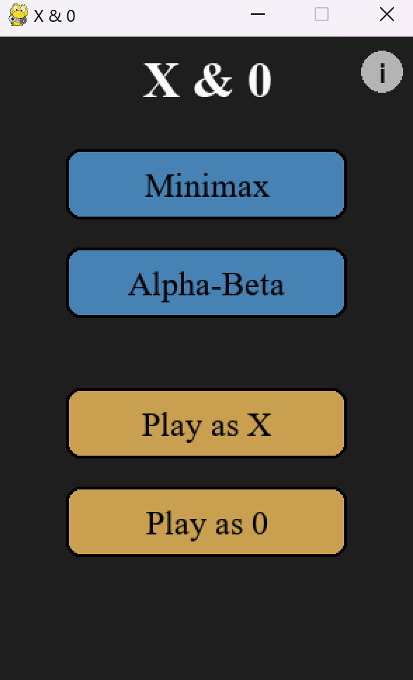
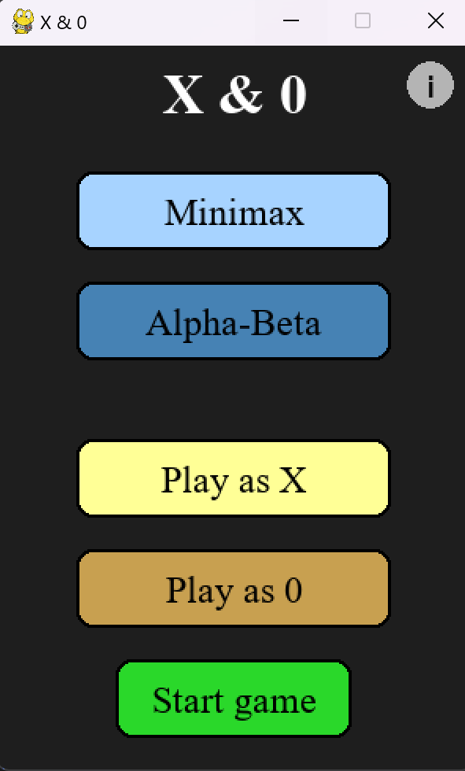
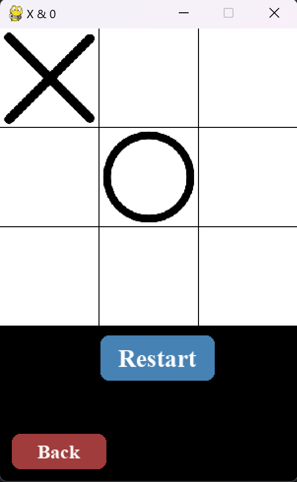
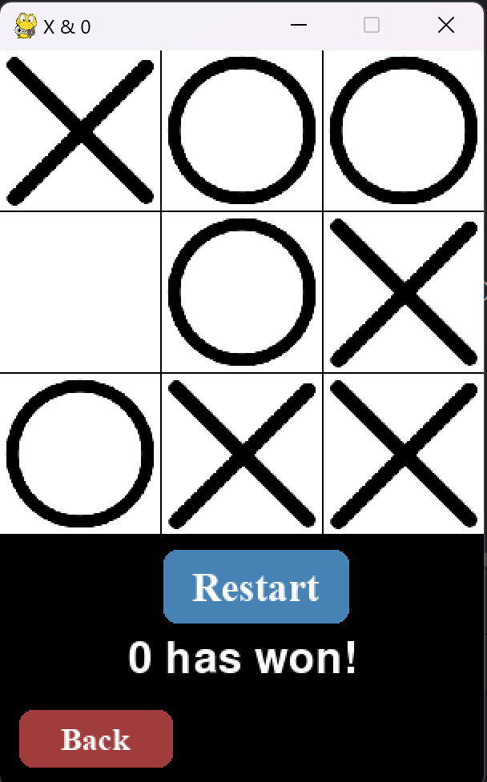
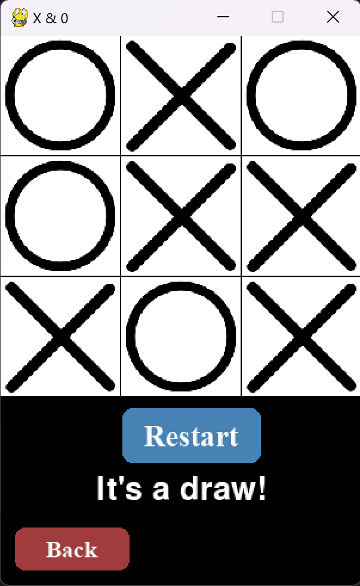

# 🎮 X & 0 - AI Tic-Tac-Toe Game

X & 0 is an interactive Tic-Tac-Toe game built using **Python** and **Pygame**. It supports two intelligent algorithms: **Minimax** and **Alpha-Beta Pruning**.  
This project was developed for personal portfolio purposes and is a rework of a classroom assignment.

## Features

1. **AI Algorithm Selection**
   - **Minimax**: Explores the entire game tree.
   - **Alpha-Beta Pruning**: Optimized search by pruning irrelevant branches.

2. **Player Options**
   - Choose to play as **X** or **0**.
   - Turn-based interaction with the AI opponent.

3. **Interactive Interface**
   - Graphical menu for selecting game mode.
   - In-game buttons: Restart and Back to Menu.
   - Information popup that explains how the AI algorithms work.

4. **Game Mechanics**
   - Classic 3x3 grid logic.
   - Detects win, draw, and handles game restarts.
   - Smooth visuals and highlighted selections.

## 🧠 Algorithms

- **Minimax**: Evaluates all possible moves to determine the best strategy. Guarantees optimal play but may be slower.
- **Alpha-Beta**: Improves Minimax efficiency by pruning suboptimal branches without changing the outcome.

## 🖥️ Interface Snapshots

### Start Menu  


### Algorithm Info  


### Select your choices  


### Gameplay  


### Win Screen  


### Draw Screen  


## 🛠️ Project Structure & Variables

- `main.py`: Entry point containing all game logic.
- `Infogame`: Class managing the game board and AI logic.
- `Stare`: Represents the current game state in the AI tree.

**Main Global Concepts:**
- `JMIN`, `JMAX`: Represent player and AI symbols.
- `celuleGrid`: Stores the grid rectangles for drawing.
- `current_state`: Tracks the current game tree node.
- `de_mutat`: Used to handle player selection and movement.

## 🚀 How to Run

### 1. Clone the repository
```bash
git clone https://github.com/andra2602/Tic-Tac-Toe-AI-pygame.git
cd tic-tac-toe-ai-pygame
```

### 2. Install dependencies
```bash
pip install pygame
```
### 3. Run the game
```bash
python main.py
```
### 4. To exit:
Use the window close button or exit the terminal.


## 📦 Assets Folder
```bash
assets/
├── ics.png              # Image for X symbol
├── zero.png             # Image for 0 symbol
```
Make sure the assets folder is in the same directory as main.py.

## Example Interactions
Choosing Algorithm: Minimax or Alpha-Beta from menu.

Player Turn: Click a grid cell to place your symbol.

AI Response: Immediate, with visual feedback.

Game End: Victory/draw messages and options to restart or go back.


## 👩‍💻 About the Project
This version is a modernized, polished take on a university exercise.
It demonstrates knowledge of:

Search algorithms

Game loop design

Pygame GUI building

Basic process flow

---
👩‍💻 Created by [Andra](https://github.com/andra2602) – feel free to check out more projects!

___

# 🎮 X & 0 – Joc AI de X și 0

**X & 0** este un joc interactiv de X și 0 dezvoltat în **Python** folosind **Pygame**. Suportă două algoritmi inteligenți: **Minimax** și **Alpha-Beta Pruning**.  
Proiectul a fost realizat pentru portofoliul personal și reprezintă o versiune îmbunătățită a unei teme realizate în cadrul facultății.

## Funcționalități

1. **Selectarea algoritmului AI**
   - **Minimax**: Explorează complet arborele jocului.
   - **Alpha-Beta Pruning**: Optimizare care sare peste ramuri irelevante, fără să schimbe rezultatul.

2. **Opțiuni pentru jucător**
   - Poți alege să joci cu **X** sau **0**.
   - Interacțiune pe ture cu adversarul AI.

3. **Interfață Interactivă**
   - Meniu grafic pentru alegerea opțiunilor.
   - Butoane în timpul jocului: Restart și Înapoi la Meniu.
   - Ferestruică informativă despre cum funcționează algoritmii AI.

4. **Mecanică de joc**
   - Grilă clasică 3x3.
   - Detectează câștig, remiză și permite restart.
   - Animații vizuale fluide și selecții evidențiate.

## 🧠 Algoritmi

- **Minimax**: Evaluează toate mutările posibile pentru a alege strategia optimă. Garantează joc perfect, dar poate fi mai lent.
- **Alpha-Beta**: Îmbunătățește eficiența lui Minimax prin „tăierea” ramurilor neesențiale.

## 🖥️ Capturi de Ecran

### Meniu de Start  


### Despre Algoritmi  


### Alege Opțiunile  


### Jocul în Desfășurare  


### Ecran de Victorie  


### Ecran de Remiză  


## ⚙️ Structura Proiectului & Variabile

- `main.py`: Punctul de pornire care conține logica jocului.
- `Infogame`: Clasă care gestionează tabla de joc și AI-ul.
- `Stare`: Reprezintă starea curentă a jocului în arborele AI-ului.

**Concepte Globale Cheie:**
- `JMIN`, `JMAX`: Simbolurile jucătorului și AI-ului.
- `celuleGrid`: Listează pătrățelele din grilă pentru desenare.
- `current_state`: Ține minte nodul curent în arborele de joc.
- `de_mutat`: Folosit pentru a gestiona selecțiile jucătorului.

## 🚀 Cum Rulezi Jocul

### 1. Clonează repository-ul
```bash
git clone https://github.com/andra2602/Tic-Tac-Toe-AI-pygame.git
cd tic-tac-toe-ai-pygame
```
### 2. Instalează dependențele
```bash
pip install pygame
```
### 3. Pornește jocul
```bash
python main.py
```
### 4. Pentru a ieși:
Închide fereastra jocului sau terminalul.

## 📦 Folderul assets
```bash
assets/
├── ics.png              # Imaginea pentru simbolul X
├── zero.png             # Imaginea pentru simbolul 0
```
Asigură-te că folderul assets se află în același director cu main.py.

##  Exemple de Interacțiune
Alegere algoritm: Selectează Minimax sau Alpha-Beta din meniu.

Rândul jucătorului: Click pe un pătrățel din grilă pentru a face o mutare.

Răspuns AI: Răspunde instant și vizual.

Sfârșit de joc: Mesaj de câștig sau remiză, cu opțiuni de restart sau revenire la meniu.

##  👩‍💻 Despre Proiect
Această versiune este o variantă modernizată și finisată a unui proiect universitar.
Demonstrează cunoștințe legate de:

Algoritmi de căutare

Designul unui game loop

Construcția unei interfețe cu Pygame

Gestionarea logicii de joc

--- 
👩‍💻 Creat de [Andra](https://github.com/andra2602) – vezi și alte proiecte!

